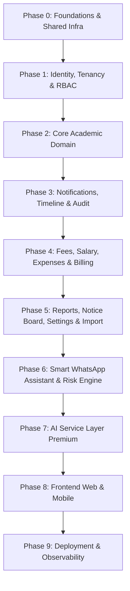

# TrueCO — Comprehensive Phase-Wise Implementation Plan
### The WhatsApp-First Coaching ERP — Engineering Blueprint & Architecture Roadmap
**Prepared by**: Senior Principal Software Architect (15+ Years Enterprise Experience)  
**Standard**: Strict Object-Oriented Clean Architecture & Modular Monolith  
**Reference Documents**: `TrueCO_Architecture_Design_Document.md` & `TrueCO_Antigravity_Build_Prompt.md`

---
==================================================
PROJECT OVERVIEW
==================================================

We are building a SaaS product called TrueCO.

TrueCO is a modern WhatsApp-First Coaching Management ERP designed for small and medium coaching institutes.

The goal is to simplify coaching operations by providing a single platform for coaching owners and teachers while eliminating the need for parents and students to install any application.

Instead of a Parent App or Student App, all communication happens through WhatsApp and Email.

TrueCO is not just a management software.

It is an automation platform that helps coaching institutes manage their daily operations with minimal manual work.

The product targets:

- Home Tuition Teachers
- Tuition Classes
- Coaching Centres
- Spoken English Institutes
- Computer Training Institutes
- Dance Academies
- Music Academies
- Art & Drawing Classes
- Abacus & Vedic Maths Centres
- Skill Training Institutes
- Hobby Classes
- Any offline institute that manages students in batches.

The platform should be simple enough for a coaching with 20 students and scalable enough for organizations with multiple branches.

==================================================
PROBLEM WE ARE SOLVING
==================================================

Existing coaching software has several problems:

- Parents rarely install or regularly use a dedicated app.
- Coaching owners spend significant time sending fee reminders, attendance updates, homework, and test results manually.
- Teachers waste time maintaining registers and Excel sheets.
- Many existing ERP systems are expensive, difficult to use, and overloaded with unnecessary features.

TrueCO solves these problems by automating communication and daily operations through WhatsApp and Email.

==================================================
OUR VISION
==================================================

Our vision is to become the operating system for coaching institutes.

Whenever a coaching owner thinks about managing students, teachers, fees, attendance, homework, tests, reports, and parent communication, they should think of TrueCO.

Every repetitive task should be automated.

The coaching staff should focus on teaching while TrueCO handles operations.

The architecture should be designed with this long-term vision in mind.

## Executive Architectural Summary

TrueCO is engineered as a high-performance, modular monolith designed to scale to **10,000+ coaching institutes, 5M+ students, and 100,000 concurrent users**. 

### Primary Architectural Pillars:
1. **Clean Architecture & Strict OOP**: Every module follows a mandatory 13-file anatomy. Domain services are pure TypeScript classes with zero framework (Express/Prisma) leakage in their public signatures.
2. **Three-Tier Multi-Tenancy Isolation**:
   - `AsyncLocalStorage` request context propagating `coachingId`.
   - Prisma middleware auto-injecting tenant filters and soft-delete checks on all queries.
   - PostgreSQL Row-Level Security (RLS) policies providing fail-closed isolation at the database engine level.
3. **Event-Driven Asynchronous Decoupling**: Mutating domain operations emit past-tense domain events (`AttendanceMarked`, `FeePaid`). Side effects (WhatsApp notifications, emails, timeline records, audit logs, risk scores) are handled exclusively by event subscribers and BullMQ queue workers.
4. **Single Choke-Point Monetization & RBAC**: Granular permissions (`resource:action`) and feature flags are evaluated via cached middleware (`loadSubscriptionState`) and declarative decorators (`@RequirePermission`, `@RequireFeature`).

---

## Phase-by-Phase Implementation Blueprint

---

### PHASE 0: Foundations & Shared Infrastructure

**Goal**: Establish the monorepo workspace, core infrastructure, Prisma multi-tenancy middleware, AsyncLocalStorage context, typed EventBus, and BullMQ queue registration.

#### Deliverables & Components:
1. **Monorepo Workspace Initialization**:
   - `pnpm` workspaces configured with `apps/api`, `apps/web`, `apps/mobile`, `packages/types`, `packages/ui`, `packages/config`, `infra/docker`, `infra/k8s`, `.github/workflows`.
   - Shared `tsconfig.base.json`, Prettier config, and ESLint configs enforcing naming conventions and layer isolation.
2. **Local Infrastructure Stack**:
   - `infra/docker/docker-compose.yml` orchestrating PostgreSQL 16 (with pgvector for future AI embeddings) and Redis 7 Alpine.
3. **Database & Multi-Tenancy Core**:
   - Prisma schema setup (`apps/api/src/database/prisma/schema.prisma`) with universal columns (`id`, `coachingId`, `createdAt`, `updatedAt`, `deletedAt`, `createdBy`, `updatedBy`).
   - `TenantPrismaMiddleware`: Extends Prisma Client to intercept queries and auto-inject `where: { coachingId, deletedAt: null }` and populate creation/update stamps.
   - `PostgresRlsInitializer`: Script generating RLS policies on all tenant tables:
     `CREATE POLICY tenant_isolation ON <table> USING (coaching_id = current_setting('app.current_coaching_id')::uuid)`.
4. **Request Context Propagation**:
   - `RequestContextService` utilizing Node's `AsyncLocalStorage` to store `{ coachingId, userId, roles, permissions, traceId }`.
   - `ContextMiddleware` binding request data before entering controllers.
5. **In-Process Typed Event Bus**:
   - `IEventBus` interface and `TypedEventEmitter` implementation in `apps/api/src/events/`.
   - Generic typing ensuring compile-time validation of event names and payloads.
6. **BullMQ Queue Infrastructure**:
   - `QueueRegistry` managing connection pools and registering the 9 core queues:
     `whatsapp-queue`, `email-queue`, `reminder-queue`, `pdf-queue`, `report-queue`, `ai-queue`, `import-queue`, `analytics-queue`, `cleanup-queue`.
   - Exponential retry backoff and DLQ routing defaults.
7. **Observability Foundation**:
   - `LoggerService` wrapping `pino` with JSON formatting and automatic extraction of `traceId`, `coachingId`, and `userId` from `RequestContext`.
   - `/health/live` and `/health/ready` endpoints verifying DB and Redis responsiveness.

#### Definition of Done (Phase 0):
- `pnpm install` and `pnpm build` complete with 0 errors.
- PostgreSQL & Redis run healthily via Docker Compose.
- Automated tests prove `TenantPrismaMiddleware` automatically injects `coachingId` and filters out soft-deleted records.
- EventBus unit test proves events fan out to multiple typed subscribers.

---

### PHASE 1: Identity, Tenancy & RBAC

**Goal**: Implement multi-tenant authentication, Argon2id hashing, RS256 JWT tokens, refresh rotation, RBAC permission checking, coaching onboarding with a 60-day full-feature trial, and the non-negotiable cross-tenant isolation test.

#### Modules:
- `apps/api/src/modules/auth/`
- `apps/api/src/modules/rbac/`
- `apps/api/src/modules/coaching/`

#### Deliverables & Components:
1. **Data Model**:
   - `Users`, `Roles`, `Permissions`, `RolePermissions`, `UserRoles`, `Coachings`, `RefreshTokens`, `Subscriptions`, `Plans`.
2. **Security & Cryptography**:
   - `PasswordHasherService` using Argon2id with OWASP-recommended memory/time limits.
   - `JwtTokenService` using RS256 asymmetric keys (private key for signing, public key for verification).
   - `RefreshTokenService` supporting token rotation and reuse detection (revoking entire token family on replay attempt).
   - Account lockout via Redis sliding window (`5 failed attempts -> 15 min lock`).
3. **RBAC Engine**:
   - `PermissionService` caching role-to-permission mappings in Redis.
   - Declarative `@RequirePermission('resource:action')` decorator and Express middleware.
   - Seed script pre-populating standard roles: `SUPER_ADMIN`, `OWNER`, `TEACHER` with granular permission codes.
4. **Coaching Registration & 60-Day Trial Provisioning**:
   - `CoachingService.registerCoaching()` orchestrates atomic creation of:
     - `Coaching` record
     - Owner `User` record
     - Assignment of `OWNER` role
     - `Subscription` with `status: TRIALING`, `trialEndsAt = now() + 60 days`, and **full feature bundle unlocked**.
     - Initial `AiCreditWallet` balance.
5. **Cross-Tenant Isolation Test**:
   - Automated test creating Coaching A and Coaching B.
   - User from Coaching A attempts to read/update Coaching B's records.
   - Validates that RLS and Prisma middleware strictly reject the request.

#### Definition of Done (Phase 1):
- Full auth lifecycle working: Register Coaching -> Login -> Refresh Token -> Logout.
- Role/Permission checks prevent unauthorized endpoints.
- Cross-tenant isolation automated test passes 100%.

---

### PHASE 2: Core Academic Domain

**Goal**: Model and implement students, parents, teachers, batches, attendance sessions, homework, and tests with composite unique constraints and domain event emissions.

#### Modules:
- `apps/api/src/modules/students/`
- `apps/api/src/modules/parents/`
- `apps/api/src/modules/teachers/`
- `apps/api/src/modules/batches/`
- `apps/api/src/modules/attendance/`
- `apps/api/src/modules/homework/`
- `apps/api/src/modules/tests/`

#### Deliverables & Components:
1. **Relational Models & Constraints**:
   - `Students`, `Parents`, `StudentParents` (M:N).
   - `Batches`, `BatchStudents` (M:N with `joinedAt` and `leftAt` tracking).
   - `Teachers`, `TeacherBatches` (M:N).
   - `AttendanceSessions`, `AttendanceRecords` (`status: PRESENT | ABSENT | LATE | EXCUSED`).
   - `Tests`, `TestResults` with composite unique constraint `(testId, studentId)`.
   - `Homework`, `HomeworkSubmissions`.
2. **Object-Oriented Service Implementations**:
   - `StudentService`: Enroll, transfer batches, link parents.
   - `BatchService`: Create batches, assign teachers, manage enrollments.
   - `AttendanceService`: Create `AttendanceSession`, bulk record `AttendanceRecords` in a single transaction. Emits `AttendanceMarked`.
   - `TestService`: Create test, bulk upsert `TestResults`. Emits `TestCreated`, `MarksUploaded`, `TestResultReady`.
   - `HomeworkService`: Assign homework with optional attachments. Emits `HomeworkCreated`, `HomeworkUpdated`.
3. **Data-Level Security**:
   - `@RequireBatchAccess()` policy guard ensuring Teachers can only view/mark attendance for their assigned batches.
4. **Event Emission Discipline**:
   - Services contain **zero** inline notification or timeline logic. State transitions only publish domain events to `IEventBus`.

#### Definition of Done (Phase 2):
- All 7 academic modules implemented following the 13-file shape.
- Upsert on `(testId, studentId)` tested and idempotent.
- Batch enrollment history (`joinedAt`, `leftAt`) accurately preserved.
- Unit tests with mock repositories cover all business rules.

---

### PHASE 3: Notifications, Timeline & Audit (Cross-Cutting Subscribers)

**Goal**: Build the Notification Orchestrator, WhatsApp and Email adapters, queue workers, TimelineSubscriber, AuditSubscriber, and webhook status ingestion.

#### Modules:
- `apps/api/src/modules/notifications/`
- `apps/api/src/modules/timeline/`
- `apps/api/src/modules/audit/`

#### Deliverables & Components:
1. **Third-Party Messaging Adapters**:
   - `IWhatsAppAdapter` -> `MetaCloudWhatsAppAdapter` (Graph API v19+), `MockWhatsAppAdapter`.
   - `IEmailAdapter` -> `SmtpEmailAdapter` (Nodemailer), `MockEmailAdapter`.
2. **Notification Orchestrator**:
   - `NotificationOrchestratorService`: Receives domain events, checks tenant communication preferences (`Settings.channels`), and enqueues jobs to `whatsapp-queue` and `email-queue`.
3. **Queue Workers (`apps/api/src/workers/`)**:
   - `WhatsAppWorker`: Picks up jobs, enforces per-tenant BullMQ rate limiter, checks deterministic `idempotencyKey` in `NotificationHistory`, dispatches via adapter, records status.
   - `EmailWorker`: Dispatches formatted HTML emails via SMTP adapter.
   - Dead-letter routing on repeated failures.
4. **Cross-Cutting Event Subscribers**:
   - `TimelineSubscriber`: Subscribes to `AttendanceMarked`, `HomeworkCreated`, `TestResultReady`, `FeePaid`, etc., and normalizes entries into `StudentTimeline`.
   - `AuditSubscriber`: Subscribes to mutating domain events and records actor, IP, before/after state diff into `AuditLogs`.
5. **Webhook Handlers & Delivery Tracking**:
   - Meta WhatsApp webhook endpoint verifying signature and updating `NotificationHistory` status (`SENT`, `DELIVERED`, `READ`, `FAILED`).
   - Owner-facing API: `GET /api/v1/notifications/failed` and `POST /api/v1/notifications/retry`.

#### Definition of Done (Phase 3):
- Phase 2 events (`AttendanceMarked`, `MarksUploaded`) trigger real queue jobs and populate `StudentTimeline` and `AuditLogs`.
- Idempotency verified: re-running a job does not re-send external messages.
- Webhook status updates reflect correctly in the database.

---

### PHASE 4: Fees, Salary, Expenses & Billing

**Goal**: Implement comprehensive financial operations, fee plans/installments, payment transactions, BullMQ reminder scheduler, subscription state machine, feature-flag choke point, and PDF receipts.

#### Modules:
- `apps/api/src/modules/fees/`
- `apps/api/src/modules/salary/`
- `apps/api/src/modules/expenses/`
- `apps/api/src/modules/billing/`

#### Deliverables & Components:
1. **Fee & Finance Models**:
   - `FeePlans`, `FeeInstallments`, `FeeTransactions` (supporting partial payments, discounts, waivers).
   - `Salaries`, `SalaryPayments`, `Expenses`.
2. **Reminder Scheduler (BullMQ Repeatable Jobs)**:
   - `FeeReminderScheduler`: Daily job running per tenant timezone.
   - Scans `FeeInstallments` using partial index `WHERE status = 'PENDING'` against `ReminderRules` (7 days before, 3 days before, on due date, overdue).
   - Emits `ReminderTriggered` -> enqueues WhatsApp/Email reminders.
3. **Subscription Lifecycle & 402 Upgrade Choke Point**:
   - `SubscriptionService` managing transitions: `TRIALING` -> `ACTIVE` / `PAST_DUE` -> `GRACE` -> `EXPIRED`.
   - `loadSubscriptionState` middleware caching active capabilities in Redis.
   - `@RequireFeature('feature_code')` returning `402 Payment Required` with upgrade CTA payload.
4. **PDF Generation Worker**:
   - `pdf-queue` worker generating fee receipts and invoices using a sandboxed templating engine.

#### Definition of Done (Phase 4):
- Fee payment with partial payments, waivers, and receipt generation passes integration tests.
- Daily reminder scheduler triggers correct jobs for pending installments.
- End-to-end tests verify trial expiration, grace period read-only behavior, and 402 responses.

---

### PHASE 5: Reports, Notice Board, Settings & Import

**Goal**: Implement heavy background report generation, bulk Excel data import with transactional batch rollback, coaching settings JSONB, and aggregated dashboards.

#### Modules:
- `apps/api/src/modules/reports/`
- `apps/api/src/modules/notice-board/`
- `apps/api/src/modules/dashboard/`
- `apps/api/src/modules/settings/`
- `apps/api/src/modules/import/`

#### Deliverables & Components:
1. **Heavy Report Generation**:
   - `report-queue` worker generating monthly attendance, fee collection, and expense summaries.
2. **Bulk Excel Import Engine**:
   - `import-queue` background worker parsing XLSX files for Students, Teachers, and Batches.
   - Row-by-row Zod validation with detailed `ImportErrors` reporting.
   - Transactional chunking ensuring failed chunks roll back safely.
3. **Tenant Settings**:
   - `Settings` entity storing logo URL, timezone, branding, academic calendar, and WhatsApp credentials in JSONB.
4. **Aggregated Dashboards**:
   - High-performance read-only queries for Owner overview and Teacher overview.

#### Definition of Done (Phase 5):
- Bulk import of 1,000+ student rows succeeds with partial error reporting.
- Reports generate asynchronously and save to object storage.
- Settings update and reflect across notification branding.

---

### PHASE 6: Smart WhatsApp Assistant & Risk Engine

**Goal**: Implement inbound parent WhatsApp message handling (free tier) with identity resolution and rule-based intent classification, plus the rule-based Student Risk Engine.

#### Modules:
- `apps/api/src/modules/whatsapp-assistant/`
- `apps/api/src/modules/risk-engine/`

#### Deliverables & Components:
1. **Inbound WhatsApp Webhook**:
   - Ingests parent messages, deduplicates via `messageId`.
2. **Parent-Student Identity Resolver**:
   - Resolves phone number -> `Parent` -> `StudentParents`.
   - Handles multi-child ambiguity ("Reply 1 for Riya, 2 for Arjun").
3. **Deterministic Intent Classifier**:
   - Keyword/pattern matching for: `fees`, `attendance`, `results`, `homework`, `holidays`, `help`.
   - Calls read-only query facades of Phase 2 & Phase 4 modules.
   - Free-tier feature (zero AI credits consumed).
4. **Student Risk Engine**:
   - Weighted formula:
     $$\text{Risk} = w_1 \cdot \text{AttDrop} + w_2 \cdot \text{MarksDecline} + w_3 \cdot \text{DaysFeeOverdue} + w_4 \cdot \text{MissedHomework}$$
   - Event-driven recompute on academic changes + nightly batch recompute.
   - Emits `RiskDetected` when risk threshold is crossed.

#### Definition of Done (Phase 6):
- Inbound WhatsApp webhook correctly replies to fee/attendance inquiries.
- Multi-child disambiguation flow functions seamlessly.
- Risk engine calculates risk scores and triggers alerts.

---

### PHASE 7: AI Service Layer (Premium)

**Goal**: Build the multi-provider LLM abstraction layer, versioned prompt templates, Redis response caching, AI credit wallet metering, and specialized AI analytics modules.

#### Module:
- `apps/api/src/modules/ai/`

#### Deliverables & Components:
1. **Model Abstraction Layer**:
   - `IAiProvider` interface implemented by `OpenAiAdapter`, `ClaudeAiAdapter`, and `GeminiAiAdapter`.
2. **Credit Wallet & Ledger**:
   - `AiCreditWallet` (balance counter) and `AiUsageLogs` (append-only ledger).
   - Atomic credit reservation and token-based deduction.
3. **Caching & Queue Architecture**:
   - Redis prompt caching keyed by `(tenantId, feature, inputDataHash)`.
   - `ai-queue` worker handling asynchronous generation.
4. **Specialized AI Features**:
   - AI Monthly Progress Summary.
   - AI Parent Report Narrative.
   - AI Teacher Performance Analysis.
   - AI Message/Announcement Drafter.

#### Definition of Done (Phase 7):
- Swapping between OpenAI, Claude, and Gemini requires only configuration changes.
- Out-of-credit tenants receive distinct `402` credit exhaustion messages.
- Prompt caching prevents duplicate LLM spend.

---

### PHASE 8: Frontend (Next.js) & Mobile (React Native)

**Goal**: Develop the responsive Web portal for Owners & Teachers and the companion React Native mobile application, utilizing shared types.

#### Applications:
- `apps/web/` (Next.js 15, Tailwind/Vanilla CSS, App Router)
- `apps/mobile/` (React Native / Expo)
- `packages/types/` (Shared contracts and DTO types)
- `packages/ui/` (Shared design system tokens)

#### Deliverables:
1. **Owner Web Portal**:
   - Executive Dashboard, Student/Parent Directory, Batch Manager, Attendance Matrix, Fee Management & Invoices, Test & Marks Entry, Notification Center & Failed Messages Retry, Settings & AI Insights.
2. **Teacher Web & Mobile Views**:
   - Assigned Batches, Daily Attendance Taker, Homework Assignor, Test Marks Entry, Student Remarks.
3. **Design Aesthetics**:
   - Premium modern UI, glassmorphism, responsive data tables, dark/light themes.

---

### PHASE 9: Deployment, Observability & Production Hardening

**Goal**: Containerization, Kubernetes manifests, CI/CD pipelines, Prometheus/Grafana metrics, and backup disaster recovery runbooks.

#### Deliverables:
1. **Docker Infrastructure**:
   - Multi-stage Dockerfiles for `api`, `web`, `workers`, and `scheduler`.
2. **Kubernetes & Helm**:
   - Deployments, ClusterIP Services, Nginx Ingress.
   - Horizontal Pod Autoscaler (HPA) scaling workers based on BullMQ queue depth.
   - Singleton deployment strategy for `scheduler`.
3. **CI/CD Pipeline**:
   - GitHub Actions pipeline: Lint -> Unit Tests -> Integration Tests -> Docker Build -> Security Scan -> Deploy.
4. **Observability**:
   - Prometheus metrics export, Grafana dashboards, Loki log aggregation.
   - PostgreSQL WAL archiving and backup verification drills.

---

## Verification & Testing Matrix

| Test Level | Scope | Technology | CI Gate |
|---|---|---|---|
| **Unit Tests** | Service business logic, policies, mappers using Fake/Mock Repositories | Jest / Vitest | Blocks PR |
| **Repository Tests** | Prisma queries and mapping against real PostgreSQL | Dockerized Postgres / Testcontainers | Blocks PR |
| **Integration Tests** | Controller -> Middleware -> Service -> DB -> EventBus -> Subscribers | Supertest | Blocks PR |
| **Tenant Isolation** | Verification of RLS policies and Prisma tenant filter enforcement | Automated Negative-Path Suite | **Non-Negotiable Phase Gate** |
| **E2E & Queues** | BullMQ job processing, idempotency, and webhook callbacks | Supertest + Redis | Blocks Release |
