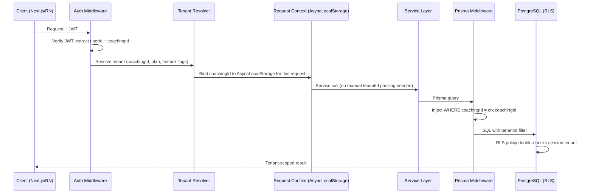
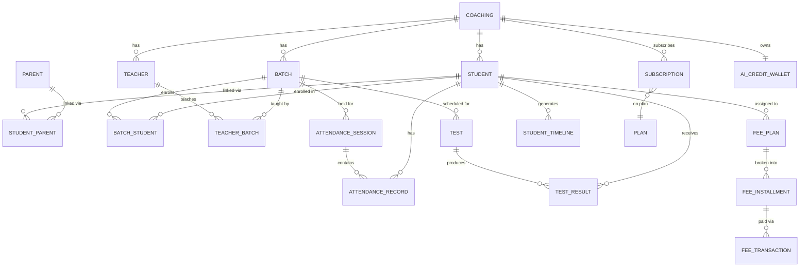
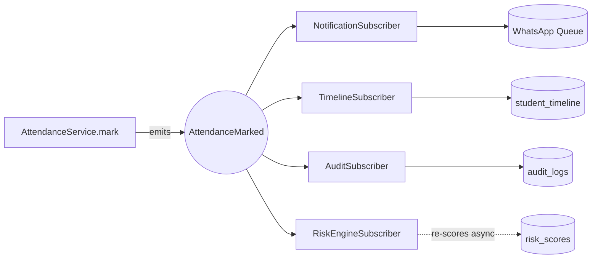
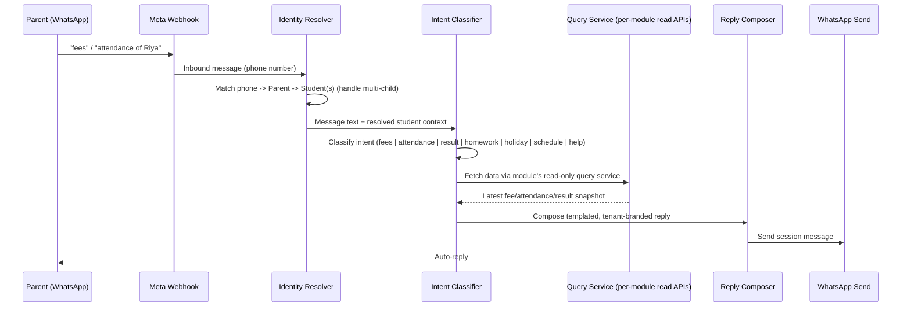
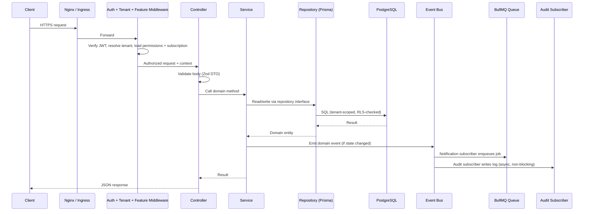
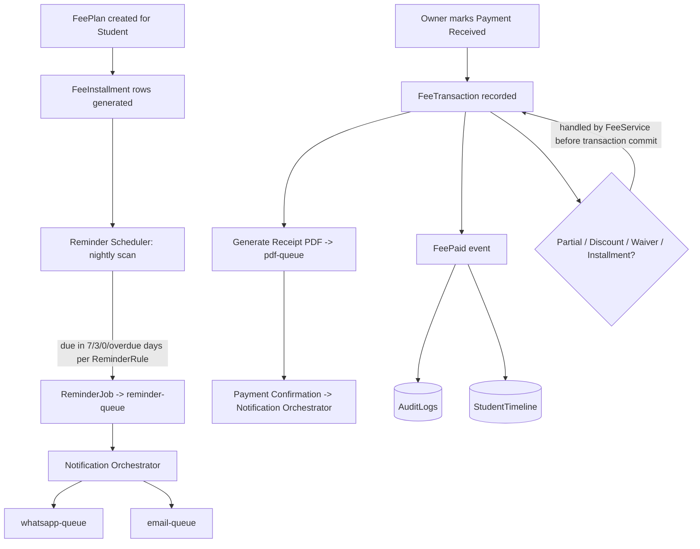

# Vargly — Architecture Design Document (ADD)
### The WhatsApp-First Coaching ERP
**Version 1.0 — Prepared for: 10,000+ coaching institutes · 5M+ students · 100,000 concurrent users**

==================================================
PROJECT OVERVIEW
==================================================

We are building a SaaS product called Vargly.

Vargly is a modern WhatsApp-First Coaching Management ERP designed for small and medium coaching institutes.

The goal is to simplify coaching operations by providing a single platform for coaching owners and teachers while eliminating the need for parents and students to install any application.

Instead of a Parent App or Student App, all communication happens through WhatsApp and Email.

Vargly is not just a management software.

It is an automation platform that helps coaching institutes manage their daily operations with minimal manual work.

The product targets:

- Home Tuition Teachers
- Tuition Classes
- Coaching Centres
- Spoken English Institutes
- Computer Training Institutes
- Dance Academies
- Music Academies
- Art & Drawing Classes
- Abacus & Vedic Maths Centres
- Skill Training Institutes
- Hobby Classes
- Any offline institute that manages students in batches.

The platform should be simple enough for a coaching with 20 students and scalable enough for organizations with multiple branches.

==================================================
PROBLEM WE ARE SOLVING
==================================================

Existing coaching software has several problems:

- Parents rarely install or regularly use a dedicated app.
- Coaching owners spend significant time sending fee reminders, attendance updates, homework, and test results manually.
- Teachers waste time maintaining registers and Excel sheets.
- Many existing ERP systems are expensive, difficult to use, and overloaded with unnecessary features.

Vargly solves these problems by automating communication and daily operations through WhatsApp and Email.

==================================================
OUR VISION
==================================================

Our vision is to become the operating system for coaching institutes.

Whenever a coaching owner thinks about managing students, teachers, fees, attendance, homework, tests, reports, and parent communication, they should think of Vargly.

Every repetitive task should be automated.

The coaching staff should focus on teaching while Vargly handles operations.

The architecture should be designed with this long-term vision in mind.

## 1. Executive Summary

Vargly is a multi-tenant SaaS ERP for coaching institutes in India. Its defining constraint is that **parents and students never install software** — every interaction happens through WhatsApp (Meta Cloud API) and Email. Only two human actor types log into the actual product: **Coaching Owners** and **Teachers**, plus a **Super Admin** who operates the platform itself.

This forces three architectural commitments that shape everything downstream:

1. **Notifications are not a side feature — they are a core domain.** Every write operation (attendance marked, fee generated, test result uploaded) must reliably fan out to WhatsApp/Email, survive provider outages, and be auditable. This pushes us toward an **event-driven, queue-backed** design from day one, not as a later optimization.
2. **The system is the only interface for parents.** The "Smart WhatsApp Assistant" (parents texting "fees" and getting an instant answer) means the backend must expose safe, tenant-scoped, read-optimized query paths that a bot layer can call — effectively a second, narrower API surface.
3. **Monetization is entirely in AI**, while the ERP itself is free forever. This means subscription/feature-flag/credit-metering logic must be a first-class cross-cutting concern wired into *every* module, not bolted onto billing alone.

**Recommended architecture:** Modular Monolith, internally structured using **Clean Architecture** layering, deployed on Node.js/TypeScript/Express, Prisma/PostgreSQL, Redis + BullMQ, with a clear seam-based path to extract services (Notifications, AI, Reports/Analytics, Auth) once traffic justifies it. Full reasoning in §3.

---

## 2. Architecture Principles

| # | Principle | What it means in practice |
|---|---|---|
| 1 | **Tenant isolation is non-negotiable** | Every query, cache key, queue job, and S3 path is tenant-scoped by construction, not by convention (see §5). |
| 2 | **Modules are independent, contracts are explicit** | Modules talk to each other only through domain events or well-defined service interfaces — never by importing another module's repository directly. |
| 3 | **Every state change is an event** | State changes emit domain events; side effects (notify, audit, timeline, AI trigger) are event *subscribers*, not inline code in the write path. |
| 4 | **Free core, metered AI** | Every AI-module entry point passes through a single `SubscriptionGuard` + `AiCreditService` — there is exactly one place this is enforced. |
| 5 | **Idempotency everywhere async** | Every queue job and webhook handler is safe to run twice (WhatsApp/Email providers *will* retry, and workers *will* crash mid-job). |
| 6 | **Design for horizontal scale-out, not vertical** | Stateless API/worker processes; all shared state lives in Postgres/Redis/S3 so we can add pods, not bigger boxes. |
| 7 | **Cheap to start, cheap to prove wrong** | Modular Monolith + managed Postgres/Redis on day one; no premature microservices, no premature Kubernetes complexity beyond what's needed (see §16, §18). |
| 8 | **Everything auditable** | Any action a Teacher/Owner/Super Admin takes that mutates data is logged with who/when/what/before-after. |

---

## 3. Architecture Style — Comparison & Decision

### 3.1 Layered vs Clean vs Hexagonal vs Onion vs DDD

| Style | Strength | Weakness for Vargly |
|---|---|---|
| **Traditional Layered (Controller→Service→Repo)** | Simple, familiar to any team | Domain logic leaks into services that also know about HTTP/DB; hard to keep 20+ modules from becoming spaghetti as team grows |
| **Hexagonal (Ports & Adapters)** | Excellent isolation of infrastructure (great for swapping WhatsApp provider, AI provider) | Heavier ceremony (ports for everything) is overkill for CRUD-heavy modules like "Notice Board" |
| **Onion Architecture** | Strong dependency-inversion discipline, domain at the center | Conceptually close to Clean Architecture but with less mainstream Node.js tooling/convention |
| **Domain-Driven Design (strategic)** | Bounded contexts map naturally onto our modules (Fees, Attendance, AI...) and onto the future microservice boundaries | Full tactical DDD (aggregates, value objects everywhere) is more ceremony than a lean team needs on day one |
| **Clean Architecture** | Clear dependency rule (domain has zero framework imports), pragmatic, maps cleanly to Controller/DTO/Service/Repository per module as you already specified | None significant for our case |

**Decision: Clean Architecture principles applied *pragmatically* inside a DDD-flavored module boundary, implemented as a Layered structure per module.**

Concretely, per module: `controller → dto/validator → service (domain logic) → repository (Prisma) → database`, where:
- **Domain/service layer** never imports Express types or Prisma types directly in its public function signatures — it depends on interfaces (`IStudentRepository`), so infra (Prisma, S3, WhatsApp client) is swappable and unit-testable without a DB.
- **Module boundaries = future microservice boundaries** (DDD's bounded-context thinking), even though we ship them in one deployable today. This is the single most important decision for the 10-year horizon: it's what makes §18's extraction plan low-risk instead of a rewrite.
- We do **not** adopt full Hexagonal ports-for-everything or tactical DDD aggregates — the extra ceremony isn't justified by team size or module complexity; we get 90% of the benefit (testability, swappable infra, clean extraction seams) for 30% of the cost.

### 3.2 Modular Monolith vs Microservices — Decision

**Decision: Modular Monolith at launch.** Full reasoning:

| Factor | Microservices Day 1 | Modular Monolith Day 1 |
|---|---|---|
| Team size (early stage) | Needs a platform/DevOps function to manage 10+ services, service mesh, distributed tracing before you have paying customers | One deploy pipeline, one process type to operate |
| Data consistency | Attendance→Notification→Timeline→Audit chain needs sagas/distributed transactions from day one | Single Postgres = real transactions where needed, events for the rest |
| Cost at low tenant count | Multiple always-on services = high baseline AWS bill for near-zero traffic | One API service + one worker service, scales to near-zero |
| Iteration speed | Cross-service refactors are slow (contract versioning, deploy coordination) | Change a module's internals freely as domain understanding matures in year 1 |
| Migration cost later | N/A | **Low**, because module boundaries were designed as bounded contexts from day one (§18) |

The monolith is *modular*, not a "big ball of mud": each module owns its own Prisma models, its own service/repo layer, and communicates cross-module only via the internal Event Bus (§10) or explicitly exported module-facade functions — never by reaching into another module's repository. This is what makes the later split mechanical rather than archaeological.

---

## 4. Tech Stack & Justification

| Layer | Choice | Why (vs alternatives) |
|---|---|---|
| Runtime/Lang | **Node.js + TypeScript** | Single language across API, workers, and (via React Native) mobile; huge ecosystem for WhatsApp/Email SDKs; TS gives compile-time safety across a 20+ module codebase where refactors will be constant |
| Framework | **Express.js** | Explicitly requested; minimal, unopinionated, huge middleware ecosystem, easy to wrap with our own layered structure — we don't need NestJS's DI ceremony since we enforce structure via folder conventions + code review, not framework magic |
| ORM | **Prisma** | Type-safe queries generated from schema = fewer runtime SQL bugs across 30+ tables; excellent migration tooling; the main trade-off (less flexibility for very exotic raw SQL) is solved by Prisma's `$queryRaw` escape hatch for reporting/analytics queries |
| Database | **PostgreSQL** | JSONB for flexible fields (settings, AI prompt configs) without going full NoSQL; strong relational integrity for fees/attendance/tests where correctness matters; mature partitioning/read-replica story for 5M+ students |
| Cache | **Redis** | Session/rate-limit/hot-dashboard-query caching; doubles as BullMQ's backing store — one piece of infra, two jobs |
| Queue | **BullMQ (Redis-backed)** | Native TS support, delayed jobs (fee reminders), priorities, concurrency control, dead-letter handling out of the box — avoids standing up Kafka/RabbitMQ before we need that throughput |
| Storage | **S3-compatible object storage** | Homework attachments, result PDFs, receipts, logos — cloud-agnostic (works on AWS S3, DO Spaces, MinIO for self-host) via a single storage adapter interface |
| Auth | **JWT (access) + rotating refresh tokens, Argon2 hashing** | Argon2 is the current OWASP-recommended hash (memory-hard, GPU-resistant) — stronger default than bcrypt; refresh rotation limits the blast radius of a leaked refresh token (§12) |
| Validation | **Zod** | Runtime validation *and* static TS types from the same schema — DTOs are defined once |
| API style | **REST + OpenAPI/Swagger** | Coaching-owner-facing CRUD-heavy domain maps naturally to REST; OpenAPI spec doubles as the contract for the React Native apps and for future partner integrations (payment gateways, etc.) |
| Realtime | **WebSocket, only where required** (e.g., live "Notification sent" ticker on Owner dashboard) | Avoids the operational cost of stateful WS connections everywhere; most of the product is fine with request/response + polling |
| Frontend (web) | **Next.js** | SSR for fast first paint on Owner/Teacher dashboards, file-based routing, React Server Components for data-heavy report pages |
| Mobile (Admin/Teacher) | **React Native** | One codebase for Owner + Teacher mobile; shares types with the Next.js app via a shared `packages/types` package |
| Infra | **Docker → Docker Compose (dev) → Kubernetes (prod)** | Standard, cloud-agnostic containerization path; see §16–17 |
| CI/CD | **GitHub Actions** | Native to GitHub, sufficient for our pipeline complexity (§17) without a separate CI platform |

---

## 5. Multi-Tenancy Design

### 5.1 Comparison

| Model | Isolation | Ops complexity | Cost at 10,000+ tenants |
|---|---|---|---|
| **Separate Database per tenant** | Strongest | Very high — 10,000 DBs to migrate/monitor/backup | Very high |
| **Shared DB, Separate Schema per tenant** | Strong | High — 10,000 schemas; connection pooling and migrations get painful past a few thousand tenants | Medium-high |
| **Shared DB, Shared Schema, `tenantId` column** | Enforced in application + DB constraints | Low — one schema, one migration to run | Low |

**Decision: Shared Database, Shared Schema, with `tenantId` (called `coachingId`) on every tenant-scoped table**, reinforced with:

- **Row-Level Security (RLS)** in PostgreSQL as a defense-in-depth layer, in addition to application-level filtering — even if a developer forgets a `WHERE coachingId = ?`, RLS blocks cross-tenant reads at the DB engine level.
- A **Prisma middleware** that automatically injects `coachingId` into every query for tenant-scoped models, so engineers cannot accidentally omit it.
- Composite indexes always lead with `coachingId` (§6.4) so tenant-scoped queries stay index-friendly even at 5M+ student scale.
- **Escape hatch for future large Enterprise tenants:** the storage adapter and repository interfaces are designed so a specific huge tenant *could* be moved to a dedicated schema or database later without changing application code — only the tenant-resolution layer changes.

### 5.2 `tenantId` Flow Through a Request



Using **Node's `AsyncLocalStorage`** to carry `coachingId` through the whole async call chain means service/repository code never has to manually thread a `tenantId` parameter through every function — it's implicit context, reducing the chance of a missed filter, while the Prisma middleware still makes it explicit at the query layer.

### 5.3 Security Implications

- A leaked JWT only ever grants access to **one** tenant's data (encoded `coachingId` is verified against the DB-stored membership on every request, not just trusted from the token blindly, to survive role/tenant changes mid-session).
- RLS policies mean even a raw SQL bug or a forgotten Prisma filter fails closed, not open.
- S3 object keys are prefixed `coaching/{coachingId}/...` and access is brokered only through signed URLs generated server-side after an authorization check — never public bucket access.
- Redis cache keys are prefixed `tenant:{coachingId}:...` to prevent cross-tenant cache bleed.

---

## 6. Database Design

### 6.1 Universal Column Convention

Every table (except pure lookup/reference tables) includes:

```
id            UUID       PRIMARY KEY DEFAULT gen_random_uuid()
coachingId    UUID       NOT NULL REFERENCES coachings(id)   -- omitted only on platform-level tables (e.g. Coaching itself, SuperAdmin)
createdAt     TIMESTAMPTZ NOT NULL DEFAULT now()
updatedAt     TIMESTAMPTZ NOT NULL DEFAULT now()
deletedAt     TIMESTAMPTZ NULL          -- soft delete
createdBy     UUID       NULL REFERENCES users(id)
updatedBy     UUID       NULL REFERENCES users(id)
```

Soft delete is enforced via a Prisma middleware that rewrites every `find*` to add `deletedAt: null` unless explicitly overridden (e.g., an admin "trash" view) — so engineers cannot forget it.

### 6.2 Core Entity Groups (representative, not exhaustive)

**Identity & Access:** `Users`, `Roles`, `Permissions`, `RolePermissions`, `UserRoles`, `Coachings`, `RefreshTokens`, `AuditLogs`

**People:** `Students`, `Parents`, `StudentParents` (M:N — a student can have 2 guardians, a parent can have multiple children in the same coaching), `Teachers`, `TeacherBatches` (M:N)

**Academics:** `Batches`, `BatchStudents` (M:N with `joinedAt`/`leftAt` for history), `AttendanceSessions`, `AttendanceRecords`, `Tests`, `TestResults`, `Homework`, `HomeworkSubmissions` (optional, since students have no login — submission is logged by teacher or via WhatsApp media reply)

**Finance:** `FeePlans`, `FeeInstallments`, `FeeTransactions`, `Salaries`, `SalaryPayments`, `Expenses`

**Communication:** `Announcements`, `WhatsAppTemplates`, `EmailTemplates`, `NotificationJobs`, `NotificationHistory`, `MessageQueueLogs`, `ReminderRules`, `ReminderJobs`

**Growth engine (student-centric):** `StudentTimeline`, `RiskScores`

**Platform/Billing:** `Plans`, `Subscriptions`, `FeatureFlags`, `CoachingFeatureOverrides`, `AiCreditWallets`, `AiUsageLogs`, `AiConversations`, `Coupons`, `CouponRedemptions`, `Invoices`, `PaymentEvents`

**System:** `Settings` (per-coaching JSONB config), `AuditLogs`, `NotificationHistory`, `ImportJobs`, `ImportErrors`

### 6.3 Key Relationships Explained

| Relationship | Type | Why |
|---|---|---|
| `Coaching` → `Students`/`Teachers`/`Batches` | 1:N | Tenant owns its people |
| `Student` ↔ `Parent` | M:N via `StudentParents` | Real families: one parent, multiple kids at the same coaching; some students have two guardians both receiving WhatsApp updates |
| `Batch` ↔ `Student` | M:N via `BatchStudents` with `joinedAt`/`leftAt` | Students move batches mid-term; history must be preserved for accurate attendance/report timelines, not just current state |
| `Teacher` ↔ `Batch` | M:N via `TeacherBatches` | A teacher can teach multiple batches, a batch can have multiple subject-teachers |
| `AttendanceSession` → `AttendanceRecords` | 1:N | One "session" (batch + date + slot) generates N per-student records — lets us compute batch-level attendance % without re-scanning all records |
| `Test` → `TestResults` | 1:N | One test, one result row per student, with a **composite unique constraint** `(testId, studentId)` to make re-uploads idempotent (upsert) |
| `FeePlan` → `FeeInstallments` → `FeeTransactions` | 1:N:N | Plan defines what's owed; installments define *when*; transactions record actual payments — supports partial payment, this is why it's 3 tables not 1 |
| `Subscription` → `Coaching` | 1:1 (current) but modeled 1:N with an `isActive` flag | Preserves subscription *history* (plan changes, past trial) instead of overwriting — needed for billing audit and churn analytics |
| `AiCreditWallet` → `AiUsageLogs` | 1:N | Wallet holds current balance (denormalized counter, updated transactionally); usage log is the append-only ledger that balance is reconciled against |

### 6.4 Indexing & Constraints Strategy

- **Composite indexes always lead with `coachingId`**: e.g. `(coachingId, batchId, createdAt)` on `AttendanceSessions` — since virtually every query is tenant-scoped first, this keeps index scans tight even with 5M+ rows in a shared table.
- **Partial indexes** for common filtered queries: e.g. `CREATE INDEX ON fee_installments (coachingId, dueDate) WHERE status = 'PENDING'` — dramatically shrinks the index used by the fee-reminder scheduler, which only ever looks at pending installments.
- **Unique constraints**: `(coachingId, email)` on `Users` (not global-unique — the same email could theoretically belong to two coachings' teachers, though app UX discourages it), `(testId, studentId)` on `TestResults`, `(batchId, studentId)` (partial, `WHERE leftAt IS NULL`) on `BatchStudents` to prevent duplicate active enrollment.
- **Enums** (Postgres native enums) for closed sets that change rarely: `Role { SUPER_ADMIN, OWNER, TEACHER }`, `AttendanceStatus { PRESENT, ABSENT, LATE, EXCUSED }`, `NotificationChannel { WHATSAPP, EMAIL }`, `NotificationStatus { QUEUED, SENT, DELIVERED, READ, FAILED }`. For sets likely to grow (e.g., `PlanCode`), we use a lookup table instead of an enum, since Postgres enum alteration is a migration-heavy operation.
- **JSONB** used narrowly and deliberately: `Settings.config`, `AiConversations.rawPayload`, `WhatsAppTemplates.variables`, `AuditLogs.beforeState`/`afterState` — anywhere the shape is provider-defined, variable across tenants, or genuinely schemaless. Never used for data we need to filter/index/join on relationally (e.g., fee amounts stay typed columns, not JSON).
- **Cascade rules**: `Coaching` deletion cascades soft-delete only (never hard `ON DELETE CASCADE` in production — a bug deleting one row should never be able to hard-delete a tenant's history). Child-of-child relations (e.g., `AttendanceRecords` on `AttendanceSessions`) use `ON DELETE RESTRICT` at the DB level as a safety net against accidental hard deletes from a script.
- **Naming convention**: tables `snake_case` plural (`fee_transactions`), Prisma models `PascalCase` singular (`FeeTransaction`), columns `camelCase` in Prisma / mapped to `snake_case` in DB via `@map`, foreign keys `<entity>Id` (`studentId`), join tables named `<A><B>` alphabetically-ish by domain sense (`BatchStudents`, not `StudentBatches`, because "which students are in this batch" is the dominant query direction).

### 6.5 ER Diagram (core academic + finance domain)



---

## 7. Folder Structure

There should be two different folder for backend and frontend
```
vargly/
├── apps/
│   ├── api/                      # Express + TS backend (the modular monolith)
│   │   ├── src/
│   │   │   ├── modules/          # one folder per bounded context — see §8
│   │   │   │   ├── auth/
│   │   │   │   ├── rbac/
│   │   │   │   ├── coaching/
│   │   │   │   ├── students/
│   │   │   │   ├── parents/
│   │   │   │   ├── teachers/
│   │   │   │   ├── batches/
│   │   │   │   ├── attendance/
│   │   │   │   ├── fees/
│   │   │   │   ├── homework/
│   │   │   │   ├── tests/
│   │   │   │   ├── reports/
│   │   │   │   ├── salary/
│   │   │   │   ├── expenses/
│   │   │   │   ├── notice-board/
│   │   │   │   ├── dashboard/
│   │   │   │   ├── settings/
│   │   │   │   ├── reminder-center/
│   │   │   │   ├── notifications/       # WhatsApp + Email send orchestration
│   │   │   │   ├── whatsapp-assistant/  # inbound parent message → intent → reply
│   │   │   │   ├── ai/                  # provider abstraction, prompts, credits
│   │   │   │   ├── risk-engine/
│   │   │   │   ├── timeline/
│   │   │   │   ├── analytics/
│   │   │   │   ├── billing/             # plans, subscriptions, coupons, invoices
│   │   │   │   ├── audit/
│   │   │   │   └── import/              # bulk Excel import
│   │   │   ├── common/            # cross-module utilities with NO domain knowledge
│   │   │   │   ├── errors/
│   │   │   │   ├── middleware/    # auth, tenant-context, rate-limit, error-handler
│   │   │   │   ├── decorators/    # @RequirePermission, @RequireFeature
│   │   │   │   ├── pagination/
│   │   │   │   └── validation/
│   │   │   ├── shared/            # shared TYPES/contracts other modules may import
│   │   │   │   ├── events/        # domain event name constants + payload types
│   │   │   │   ├── interfaces/    # repository interfaces
│   │   │   │   └── dtos/
│   │   │   ├── config/            # env parsing (Zod-validated), constants per environment
│   │   │   ├── database/
│   │   │   │   └── prisma/
│   │   │   │       ├── schema.prisma
│   │   │   │       ├── migrations/
│   │   │   │       └── seed.ts
│   │   │   ├── events/            # Event Bus implementation + subscriber registry
│   │   │   ├── queues/            # BullMQ queue definitions (one file per queue)
│   │   │   ├── workers/           # BullMQ worker processes (separate entrypoint, §17)
│   │   │   ├── scheduler/         # cron job definitions (node-cron / BullMQ repeatable)
│   │   │   ├── notifications/     # low-level WhatsApp Cloud API + SMTP clients (adapters)
│   │   │   ├── storage/           # S3-compatible adapter (upload/signed-url/delete)
│   │   │   ├── audit/             # audit-log writer service used via event subscriber
│   │   │   └── main.ts            # API server entrypoint
│   │   └── test/
│   ├── web/                       # Next.js — Owner & Teacher dashboard
│   └── mobile/                    # React Native — Owner & Teacher mobile
├── packages/
│   ├── types/                     # shared TS types (API contracts) used by api + web + mobile
│   ├── ui/                        # shared design-system components (web + mobile via RN-Web where practical)
│   └── config/                    # shared eslint/tsconfig/prettier base configs
├── infra/
│   ├── docker/                    # Dockerfiles per service
│   ├── k8s/                       # Kubernetes manifests / Helm charts
│   └── terraform/                 # (future) IaC for AWS resources
├── .github/workflows/             # CI/CD pipelines
└── docs/                          # this ADD, ADRs, runbooks
```

**Purpose of key folders:**
- `modules/*` — each is a bounded context; internally follows the Controller→DTO→Validator→Service→Repository pattern (§8). This is the unit of future microservice extraction.
- `common/` vs `shared/` distinction: `common/` is *implementation* utilities (middleware, error classes) with zero domain awareness; `shared/` is *contracts* (event names, interfaces, DTOs) that modules are allowed to depend on to talk to each other without depending on each other's internals.
- `events/` + `queues/` + `workers/` are separated because they run as **different processes** in production (API pods vs Worker pods vs Scheduler pod) — see §17 — even though they live in the same monorepo/package.
- `packages/types` is what keeps Next.js, React Native, and the API in sync without runtime coupling — generated partially from Zod schemas and Prisma types.

---

## 8. Module Design Pattern

Every module in `modules/<name>/` follows the same internal shape:

```
modules/attendance/
├── attendance.controller.ts      # HTTP layer: parses req, calls service, shapes res
├── attendance.routes.ts          # Express router, wires middleware + controller
├── dto/
│   ├── mark-attendance.dto.ts
│   └── attendance-response.dto.ts
├── validators/
│   └── attendance.validator.ts   # Zod schemas
├── attendance.service.ts         # Domain logic — no Express, no Prisma types in signatures
├── attendance.repository.ts      # Prisma queries — implements IAttendanceRepository
├── attendance.mapper.ts          # Entity <-> DTO transforms
├── attendance.policy.ts          # Authorization rules specific to this module
├── attendance.events.ts          # Events this module emits (AttendanceMarked, ...)
├── attendance.subscribers.ts     # Handlers for events this module *listens* to
├── attendance.jobs.ts            # BullMQ job producers specific to this module
├── attendance.cron.ts            # (if any) scheduled tasks owned by this module
└── attendance.module.ts          # Composition root: wires repo→service→controller, registers subscribers
```

**Why this shape:** Controller and Repository are the only two files allowed to import Express and Prisma respectively. The Service is pure TypeScript business logic, unit-testable with an in-memory fake repository — this is what lets a senior engineer confidently refactor the Fees module without fear of silently breaking Attendance, and what makes each module extractable into its own service later with minimal rewrite (mostly: controller becomes an HTTP handler in a new service, repository stays nearly identical, service is untouched).

---

## 9. RBAC (Role-Based Access Control)

### 9.1 Roles

| Role | Scope |
|---|---|
| **Super Admin** | Platform-wide. Manages coachings, plans, feature flags, global settings, impersonation for support. |
| **Owner** | Full access within their own `coachingId`. Can manage teachers, batches, fees, settings, billing. |
| **Teacher** | Scoped further to *assigned batches only* within their coaching — cannot see other teachers' batches' fee data unless explicitly granted. |

### 9.2 Permission Model

We use **granular permission strings** (`resource:action`, e.g. `attendance:mark`, `fees:refund`, `tests:delete`) grouped into role defaults, rather than hardcoding role checks — this is what lets Owners later create **custom sub-roles** (e.g., "Front Desk" with only `fees:collect` + `students:read`) without an engineering change, which is a near-certain future request from a multi-branch coaching.

```
Users ──M:N── Roles ──M:N── Permissions
```

- `RolePermissions` defines what a role can do **by default**.
- `UserRoles` assigns roles to a specific user *within a specific coaching* (a user's permission set is always evaluated in tenant context).
- **Permission inheritance**: Owner implicitly has all Teacher permissions plus Owner-only ones (fees, salary, settings) — modeled as Owner's default role bundle including the Teacher permission set, not as a runtime "role hierarchy walk," which keeps permission checks a flat, fast lookup.

### 9.3 Enforcement

```ts
@RequirePermission('attendance:mark')
@RequireFeature('core')   // vs @RequireFeature('ai') for premium endpoints
async markAttendance(req, res) { ... }
```

- **Middleware** (`tenantContext`, `authenticate`) runs first — resolves user + coaching + loads permission set into request context (cached in Redis per user-session, invalidated on role change).
- **Guards/Decorators** (`@RequirePermission`, `@RequireFeature`, `@RequireBatchAccess`) run per-route, checking the pre-loaded permission set — no DB hit on the hot path.
- **`@RequireBatchAccess`** is a Vargly-specific guard: for Teacher-role requests touching a `batchId`, it additionally verifies membership in `TeacherBatches` — this is the one place row-level scoping goes beyond simple RBAC into data-level authorization, and it's implemented as its own decorator so it's never forgotten on a new Teacher-facing endpoint.

---

## 10. Event-Driven Design

**Internal, in-process domain events** (not a message broker at this stage — see §18 for when that changes). Implementation: a lightweight typed EventEmitter wrapper (`shared/events`) so publishing and subscribing are both compile-time type-checked against the event payload.

### 10.1 Naming Convention

`<Entity><PastTenseVerb>` — e.g. `AttendanceMarked`, `FeePaid`, `TestResultReady`, `HomeworkCreated`. Always past tense (something *happened*), never imperative (`MarkAttendance` is a command, not an event — commands are just function calls).

### 10.2 Core Events

`StudentCreated`, `TeacherCreated`, `BatchCreated`, `AttendanceMarked`, `HomeworkCreated`, `HomeworkUpdated`, `TestCreated`, `MarksUploaded`, `TestResultReady`, `FeeGenerated`, `FeePaid`, `ReminderTriggered`, `NotificationSent`, `NotificationFailed`, `TimelineUpdated`, `AuditCreated`, `RiskDetected`, `SubscriptionExpiring`, `SubscriptionExpired`, `AiCreditsLow`

### 10.3 Why In-Process Events (for now)

At current scale, a distributed broker (Kafka/SQS/RabbitMQ) adds operational cost without a corresponding benefit — a single Postgres-backed BullMQ queue already gives us durability and retries for the *async work* these events trigger. The event bus's job is just **fan-out within one process**: e.g. `AttendanceMarked` triggers three independent subscribers (queue a WhatsApp job, write a timeline entry, write an audit log) without the Attendance module needing to know any of them exist.



---

## 11. Queue Architecture (BullMQ)

### 11.1 Queues

| Queue | Purpose | Priority | Concurrency |
|---|---|---|---|
| `whatsapp-queue` | Send WhatsApp messages via Cloud API | High | Tuned to Meta rate limits per tenant |
| `email-queue` | Send SMTP email | Medium | High (email providers tolerate more) |
| `reminder-queue` | Fee/birthday/homework reminders picked up by scheduler | Medium | Medium |
| `report-queue` | Generate heavy reports (monthly, batch analytics) | Low | Low, CPU-bound |
| `pdf-queue` | Result PDFs, fee receipts | Medium | Medium |
| `ai-queue` | All AI provider calls | Low (unless user-facing "AI reply now") | Rate-limited to provider quota |
| `import-queue` | Bulk Excel import processing | Low | Low |
| `analytics-queue` | Batch/attendance/fee trend rollups | Low, off-peak scheduled | Low |
| `cleanup-queue` | Purge soft-deleted rows past retention, expire old tokens | Lowest | Low |

### 11.2 Reliability Patterns

- **Retry + exponential backoff**: default 5 attempts, backoff `{ type: 'exponential', delay: 5000 }` — tuned per queue (WhatsApp/Email retry more aggressively than reports).
- **Dead Letter Queue**: jobs exhausting retries move to a `*-dlq` queue, surfaced in an Owner-visible "Failed Notifications" panel with a manual **Retry** button (this maps directly to the spec's "Retry Failed Messages" feature).
- **Idempotency**: every job payload includes a deterministic `idempotencyKey` (e.g., `whatsapp:{notificationId}`); the worker checks `NotificationHistory` before sending — so a worker crash-and-retry never double-sends a WhatsApp message to a parent.
- **Priority**: WhatsApp/Email jobs for time-sensitive events (fee-paid confirmation) outrank bulk broadcast jobs, so a 5,000-student broadcast never delays a payment receipt.
- **Concurrency & rate-limiting**: BullMQ's per-queue `limiter` is set to respect Meta's WhatsApp Cloud API per-number rate limit, with a **per-tenant sub-limiter** (via job grouping) so one large coaching's broadcast can't starve another tenant's transactional messages.
- **Workers as separate processes**: `apps/api/src/workers/*` compile to their own entrypoints, deployed as their own Kubernetes Deployment/pods (§16) — so a report-generation spike never competes with API request-handling CPU.

---

## 12. Scheduler (Cron) Architecture

Implemented as **BullMQ repeatable jobs** (not raw `node-cron`) so schedules survive process restarts and are horizontally safe (BullMQ guarantees a repeatable job fires once across all worker replicas, avoiding the classic "cron fires N times because you have N pods" bug).

| Job | Schedule | Action |
|---|---|---|
| Fee Reminder | Daily 8 AM (tenant-timezone aware) | Scans `FeeInstallments` (partial index, §6.4) against each `ReminderRule`, enqueues `reminder-queue` |
| Birthday Wishes | Daily | Finds today's student birthdays, enqueues WhatsApp |
| Daily Attendance Reminder | Configurable per-coaching, default 10 AM | Nudges teachers with pending attendance |
| Homework Reminder | Configurable | Nudges parents of students with pending homework |
| Monthly Report | 1st of month | Enqueues `report-queue` per active coaching |
| AI Monthly Summary | 1st of month, Pro AI+ tenants only | Enqueues `ai-queue`, gated by `@RequireFeature('ai')` at the job-producer level too |
| Subscription Expiry Check | Daily | Emits `SubscriptionExpiring` (7/3/1 day out) and `SubscriptionExpired` events |
| Cleanup | Weekly | Purges soft-deleted rows past retention, rotates expired refresh tokens |
| Backup Verification | Daily | Confirms automated DB backup completed (§19) |

Tenant-timezone awareness matters here: a coaching in one city shouldn't get an "8 AM" reminder at 3 AM their time — schedule evaluation always reads `Settings.timezone` per coaching rather than running one global cron tick.

---

## 13. WhatsApp Architecture

- **Provider**: Meta WhatsApp Cloud API directly (not a 3rd-party BSP wrapper), for cost control at scale and direct webhook access — abstracted behind a `WhatsAppAdapter` interface so a BSP could be swapped in later without touching module code.
- **Message types**: Template messages (required for business-initiated, e.g. fee reminder outside the 24h session window) and session messages (replies within 24h of a parent-initiated message, e.g. the Smart Assistant's replies).
- **Media**: result PDFs, homework attachments sent as media messages via the adapter's `sendMedia`.
- **Status tracking**: webhook handler ingests `sent` / `delivered` / `read` / `failed` callbacks, updates `NotificationHistory.status`, and — for `failed` — enqueues a DLQ entry for the retry panel.
- **Rate limits**: enforced both by Meta (per business number, tiered by messaging quality rating) and by our own per-tenant BullMQ limiter, so a single tenant's broadcast can never push another tenant's number into Meta's throttling tier.
- **Webhook idempotency**: Meta can redeliver webhooks; handler dedupes on `messageId` before updating status.
- **Full history stored**: `NotificationHistory` retains every outbound message + its final status, queryable per-student for the "Student Timeline" feature and for Owner-visible delivery reports.

## 14. Email Architecture

- **SMTP-based**, provider-agnostic via a `EmailAdapter` interface (SES, SendGrid SMTP, or self-hosted — swappable per tenant tier if needed for cost).
- Mirrors every WhatsApp-capable event (per spec: "everything supported in WhatsApp should also support Email") — the `notifications` module has one **Notification Orchestrator** service that, given an event, resolves the tenant's enabled channels (from `Settings`) and fans out to `whatsapp-queue` and/or `email-queue`, so individual domain modules (Fees, Attendance, etc.) never call WhatsApp/Email adapters directly — they just emit domain events.
- HTML templates (`EmailTemplates`, per-tenant overridable, same pattern as `WhatsAppTemplates`), attachments via the storage adapter, tracked delivery status via provider webhooks (SES/SendGrid bounce & open events) into the same `NotificationHistory` table with `channel: EMAIL`.

---

## 15. Smart WhatsApp Assistant (Inbound)



- **Identity resolution**: phone number → `Parent` → `StudentParents` → possibly multiple students; if ambiguous (parent has 2 kids), the assistant asks a disambiguating follow-up ("Riya or Arjun?") before answering.
- **Intent detection (launch version)**: rule-based keyword/pattern matching (fast, free, deterministic — no AI cost for a *free-tier* feature) with a fallback to "I didn't understand, reply HELP" — this is deliberately **not** gated behind the paid AI system, since it's core ERP per the spec.
- **Future AI upgrade path**: the `NLU` step is implemented behind an `IntentClassifier` interface; a Pro AI tenant can be switched to an LLM-based classifier (via the same AI Service Layer as §16) for free-text understanding beyond fixed keywords — without changing the surrounding flow.
- Every inbound message and outbound reply is logged in `NotificationHistory`/a dedicated `AssistantConversations` table for audit and for improving the rule set over time.

---

## 16. AI Architecture (Premium)

### 16.1 Design Goals

Multiple providers (OpenAI, Claude, Gemini) must be swappable **per feature, per tenant plan tier, or by cost/availability** without touching module code — and every call must be **metered against a credit wallet** before it runs.

```mermaid
flowchart TB
    subgraph Module Layer
        M1[Reports Module] --> AISvc
        M2[Attendance Module] --> AISvc
        M3[Fees Module] --> AISvc
        M4[Assistant Module] --> AISvc
    end
    AISvc[AI Service Layer] --> Guard{SubscriptionGuard\n+ AiCreditService}
    Guard -- insufficient credits/plan --> Deny[402/403 + upgrade prompt]
    Guard -- OK --> Cache{Response Cache\n(Redis, keyed by prompt hash)}
    Cache -- hit --> Return[Return cached insight]
    Cache -- miss --> Queue[ai-queue job]
    Queue --> Abstraction[Model Abstraction Layer]
    Abstraction --> P1[OpenAI Adapter]
    Abstraction --> P2[Claude Adapter]
    Abstraction --> P3[Gemini Adapter]
    P1 & P2 & P3 --> Deduct[Deduct AiCreditWallet]
    Deduct --> Log[(AiUsageLogs)]
    Deduct --> Return
```

- **AI Service Layer** (`modules/ai/`) is the single entry point every other module calls (`aiService.generate({tenantId, feature, prompt, ...})`) — no module talks to OpenAI/Claude/Gemini SDKs directly.
- **Model Abstraction Layer**: a common `IAiProvider` interface (`complete()`, `embed()`); each provider is an adapter; provider selection can be static config or dynamic (e.g., cheapest-available, or a specific provider per feature for quality reasons).
- **Prompt Templates**: versioned, stored in DB (`AiPromptTemplates`, not shown in full ER above for brevity) so prompts can be tuned without a deploy, with per-tenant branding variables interpolated in.
- **Usage Tracking & Credits**: every AI call pre-checks `AiCreditWallet.balance`, executes, then atomically deducts actual cost (token-based) and writes `AiUsageLogs` — wallet balance is the fast-path check, usage log is the audit trail it's reconciled against nightly.
- **Caching**: identical prompts (e.g., re-viewing the same monthly AI summary) are cached in Redis keyed by a hash of `(tenantId, feature, inputDataHash)` with a TTL — avoids re-billing credits for a re-render of unchanged data, and is a meaningful **cost optimization** (§20).
- **Queue-backed, not synchronous**, for anything that isn't a live chat reply (monthly summaries, batch analytics) — the user gets a "Generating..." state and a notification when ready, so a slow provider never ties up an API request thread.

---

## 17. Student Risk Engine

**Scoring approach**: a weighted rule-based score (v1) — transparent and explainable to a non-technical Owner, and free to compute (no AI credits consumed for a feature that should feel like core safety, even though positioned as differentiator):

```
riskScore = w1 * normalize(attendanceDropPct)
          + w2 * normalize(marksDecline)      // trend across last N tests, not a single low score
          + w3 * normalize(daysFeeOverdue)
          + w4 * normalize(missedHomeworkCount)
```

- Recomputed **event-driven** (on `AttendanceMarked`, `TestResultReady`, `FeeOverdue`, `HomeworkMissed` — debounced/batched, not recalculated on every single event in real time) plus a **nightly full recompute** as a consistency backstop.
- Crossing a configurable threshold emits `RiskDetected` → notifies the Owner (and optionally the assigned Teacher) via the standard Notification Orchestrator — reusing §10/§13 machinery rather than a bespoke path.
- **Future AI upgrade**: v2 can replace/augment the weighted formula with an AI-generated risk narrative ("why" this student is flagged) — again behind the same `IAiProvider` abstraction, gated to Pro AI tenants, v1 rule-based score remains available on Starter as a free-tier safety feature per the spec's philosophy.

---

## 18. Timeline Engine

Every significant student-related event across every module writes one row to `StudentTimeline` via a **generic subscriber pattern**: each module doesn't write timeline entries itself — it emits its domain event, and a single `TimelineSubscriber` (in `modules/timeline/`) listens to the full set (`AttendanceMarked`, `HomeworkCreated`, `TestResultReady`, `FeePaid`, `NotificationSent`, remarks added, etc.) and normalizes each into a common `{studentId, type, summary, refId, occurredAt}` row.

This keeps the "add a new timeline-worthy action" cost at *zero new code in the source module* — a new module just needs to emit a well-named event, and (optionally) register a small formatter function so the timeline entry reads naturally.

---

## 19. Subscription, Billing & Feature-Flag Architecture

This directly implements the updated Business Model (60-day trial → Starter / Pro AI / Enterprise).

### 19.1 Data Model

- `Plans` — `code (STARTER | PRO_AI | ENTERPRISE)`, `priceMonthly`, `priceYearly`, default feature bundle, default AI credit allotment.
- `Subscriptions` — one row per plan-period for a coaching (history preserved, not overwritten): `status (TRIALING | ACTIVE | PAST_DUE | GRACE | EXPIRED | CANCELLED)`, `trialEndsAt`, `currentPeriodEnd`, `gracePeriodEndsAt`.
- `FeatureFlags` — global catalog of flaggable features (`ai.parent_summary`, `ai.risk_detection`, `reports.advanced`, ...).
- `CoachingFeatureOverrides` — per-tenant overrides (e.g., a Starter tenant manually granted one AI feature for a pilot) — takes precedence over the plan's default bundle.
- `Coupons` / `CouponRedemptions` — code, discount type/value, validity window, usage limits; redemption recorded against a `Subscription`.
- `Invoices` / `PaymentEvents` — billing records and raw payment-gateway webhook events (future Razorpay/UPI integration, §21).

### 19.2 Enforcement — Single Choke Point

```mermaid
flowchart LR
    Req[Incoming Request] --> MW1[authenticate]
    MW1 --> MW2[tenantContext]
    MW2 --> MW3[loadSubscriptionState\n(cached in Redis, 60s TTL)]
    MW3 --> G{Route requires\n@RequireFeature?}
    G -- no --> Handler[Controller]
    G -- yes --> Check{Feature in\nplan bundle + overrides\nAND subscription ACTIVE/TRIALING/GRACE?}
    Check -- yes --> Handler
    Check -- no --> Deny[402 Payment Required\n+ upgrade CTA payload]
```

- `loadSubscriptionState` resolves the effective feature set **once per request**, cached briefly in Redis (subscription state changes rarely, so a 60s cache is safe and removes a DB hit from every hot-path request).
- **Trial**: on `Coaching` creation, a `Subscription` row is created with `status: TRIALING`, `trialEndsAt: now()+60d`, and — per the spec — **all features unlocked** (trial bundle = superset of all plans, not just Starter).
- **Grace period**: on trial/period end without a plan choice or on payment failure, `status → GRACE` for a configurable window (e.g., 7 days) with **read-only or reminder-nudging** access rather than a hard cutoff — reduces support load and churn from accidental lockouts.
- **Feature locking after expiry**: past grace, `status → EXPIRED`; `@RequireFeature`/`@RequireFeature('core')` guards start denying even core-ERP writes, but **reads remain available** (Owner can still export their data) — this is a product decision worth flagging explicitly, not an accident of the architecture (§ Risks).
- **AI credits**: independent of feature flags — a tenant can be on Pro AI (feature-unlocked) but out of credits (`AiCreditWallet.balance = 0`), in which case AI *endpoints* respond with a distinct "buy more credits" state rather than a generic feature-locked message, so Owners understand the difference between "not on your plan" and "used this month's quota."
- **Upgrades/downgrades**: modeled as closing the current `Subscription` row and opening a new one at the moment of change (prorated invoice logic lives in `billing` module) — never mutating a subscription row in place, preserving a clean audit trail for support and analytics.

---

## 20. Request Flow, Authentication, and Domain Flows

### 20.1 General Request Lifecycle



Note the audit log and notification enqueue happen **off the critical path** via the event bus — the client gets a response as soon as the core write succeeds, not after every side effect completes. This keeps p95 API latency dominated by the actual business write, not by WhatsApp API round-trips.

### 20.2 Authentication Flow

- **Login**: Argon2id password verify → issue short-lived **access JWT** (15 min) + **refresh token** (7–30 days, "remember device" extends this) stored **hashed** in `RefreshTokens` table (never store raw refresh tokens) with a `deviceId`/`userAgent` fingerprint.
- **Refresh rotation**: every refresh-token use issues a *new* refresh token and immediately invalidates the old one; reuse of an already-rotated (stolen/replayed) token triggers **immediate revocation of the entire token family** for that user — a strong signal-based defense against token theft.
- **Logout all devices**: deletes all `RefreshTokens` rows for the user; access tokens are short-lived enough (15 min) that this is effectively immediate.
- **Account lock / brute-force**: Redis-backed sliding-window counter per `(email, IP)`; N failed attempts within a window → temporary lock + exponential backoff, independent of general API rate limiting.
- **Password reset / email verification**: single-use, short-TTL signed tokens (stored hashed), delivered via the same Email adapter as the rest of the platform (dogfooding our own notification infra).

### 20.3 Domain Flow Example — Fee Flow (representative of the pattern used for Attendance/Homework/Test/Notice, per the request document)



Attendance, Homework, Test, and Notice flows follow the identical shape already shown structurally in §10.3's diagram: **domain write → event → parallel subscribers (notify, timeline, audit, [risk-engine where relevant])** — this uniformity is deliberate; it's the single pattern a new engineer needs to learn once and then recognizes in every module.

---

## 21. API Design Conventions

- **Versioning**: URL-based, `/api/v1/...` — simplest for a REST API with a controlled set of first-party clients (web/mobile we own); a breaking v2 gets its own prefix, old clients keep working.
- **Pagination**: cursor-based (`?cursor=<id>&limit=50`) for high-growth tables (students, attendance, notifications) to avoid the deep-offset performance cliff at millions of rows; simple offset pagination retained only for small, bounded lists (e.g., Batches).
- **Filtering/Sorting/Searching**: consistent query param convention — `?filter[status]=ACTIVE&sort=-createdAt&q=search+term`; complex filters (e.g., report builder) use a POST-based query endpoint instead of overloading GET query strings.
- **Response envelope**: `{ data, meta }` for success, `{ error: { code, message, details } }` for failures — consistent shape lets the frontend have one generic API client/error handler.
- **HTTP status codes**: standard semantics (`200/201/204` success, `400` validation, `401` unauthenticated, `403` unauthorized, `402` feature/subscription-gated, `404` not found, `409` conflict, `422` unprocessable, `429` rate-limited, `5xx` server).
- **Idempotency**: mutating endpoints that are safe to retry (payment recording, bulk import triggers) accept an `Idempotency-Key` header, deduped via a short-TTL Redis record.
- **Naming**: plural nouns, resource-oriented (`POST /api/v1/batches/:id/attendance-sessions`), verbs only for true actions that aren't resource CRUD (`POST /api/v1/subscriptions/:id/cancel`).

---

## 22. Security

| Area | Decision |
|---|---|
| Transport | TLS everywhere (terminated at Nginx/Ingress or ALB); HSTS enabled |
| Tokens | JWT access (short-lived) + rotating refresh (§20.2); signed with asymmetric keys (RS256) so multiple services could verify tokens without sharing the signing secret, in anticipation of §23 extraction |
| Passwords | Argon2id, tuned memory/time cost per current OWASP guidance, reviewed periodically as hardware improves |
| CSRF | Not primarily cookie-session based (JWT in Authorization header for API clients), but web app's refresh-token cookie (httpOnly, Secure, SameSite=Strict) is CSRF-protected via double-submit token on refresh endpoint |
| CORS | Explicit allow-list of first-party origins (web app, mobile via app-scheme where relevant) — no wildcard |
| SQL Injection | Eliminated by construction via Prisma parameterized queries; any raw SQL (`$queryRaw`) goes through a lint rule requiring tagged-template parameterization, never string concatenation |
| XSS | React/Next.js auto-escaping by default; any raw HTML rendering (e.g., email template preview) sanitized (DOMPurify) server- and client-side |
| Input validation | Zod schemas on every mutating endpoint, rejecting unknown fields (`strict()`) |
| Output encoding | JSON responses only for the API; PDF/HTML generation for receipts/reports uses a sandboxed templating engine, not raw string interpolation |
| Rate limiting | Redis-backed, layered: global per-IP, per-user, per-tenant, and per-sensitive-endpoint (login, OTP, password reset) |
| Secrets | Never in repo/env files committed to VCS; managed via AWS Secrets Manager / Kubernetes Secrets, injected at deploy time, rotated on a schedule |
| Encryption at rest | Managed Postgres (RDS-equivalent) encryption at rest; S3 bucket default encryption |
| Encryption in transit | TLS to DB (`sslmode=require`), TLS to Redis, TLS to all external providers |
| PII / sensitive data masking | Phone numbers/emails masked in logs and non-Owner-facing UI (e.g., support tooling); Super Admin impersonation is logged with full audit trail |
| OWASP Top 10 | Covered above (Injection, Broken Auth, Sensitive Data Exposure, XXE n/a — no XML parsing of untrusted input, Broken Access Control via RBAC+RLS §9/§5, Security Misconfiguration via infra-as-code + hardened base images, XSS, Insecure Deserialization avoided via strict JSON/Zod, Using Components with Known Vulnerabilities via automated dependency scanning in CI §17, Insufficient Logging via §23) |

---

## 23. Observability, Logging, Backup & Performance

### 23.1 Observability Stack

**Prometheus** (metrics) + **Grafana** (dashboards) + **Loki** (log aggregation) + **OpenTelemetry** (tracing across API → queue → worker, correlated by a shared `traceId`/`correlationId` injected at the edge and propagated through job payloads).

- **Application metrics**: request latency/error rate per route, DB query duration.
- **Business metrics**: active tenants, trial→paid conversion, MRR, churn — surfaced to a Super Admin dashboard, computed via the `analytics-queue`.
- **Queue metrics**: depth, processing time, failure rate per queue — alerting when `*-dlq` grows.
- **Database metrics**: connection pool saturation, slow query log, replication lag (once read replicas are added, §23.4).
- **Notification metrics**: delivery rate, WhatsApp quality rating trend (early warning before Meta throttles a number).
- **AI usage metrics**: cost per tenant per provider, cache hit rate (cost-optimization visibility).

### 23.2 Logging

Structured JSON logs (`pino`), levels `debug/info/warn/error/fatal`; every log line carries `requestId`, `coachingId`, `userId` where applicable. Distinct log streams: request logs, error logs (with stack + context), audit logs (persisted to Postgres, not just log files — audit is a compliance record, not just an operational log), queue/worker logs, notification logs, AI logs (prompt metadata, never raw PII in the log line itself — full payload stays in `AiUsageLogs`/`AiConversations` DB tables with proper access control). **Retention**: operational logs 30–90 days in Loki (cost-driven), audit logs retained indefinitely in Postgres (compliance-driven), archived to cold storage after 1 year.

### 23.3 Backup & Disaster Recovery

- **Database**: automated daily full snapshot + continuous WAL archiving for Point-In-Time Recovery; snapshots retained 30 days, weekly snapshots retained 1 year.
- **Object storage**: versioning enabled on the S3 bucket + cross-region replication for DR.
- **Targets**: RPO ≈ 5 minutes (via WAL/PITR), RTO ≈ 1 hour for full region failure (documented runbook, periodically drilled).
- **Restore process**: scripted, tested quarterly in a staging environment against a real snapshot — an untested backup is not a backup.

### 23.4 Performance Optimization

- Composite/partial indexes (§6.4); `EXPLAIN ANALYZE`-driven query review in CI for any migration touching a hot table.
- Connection pooling via PgBouncer (transaction mode) in front of Postgres, since serverless-style pod scaling can otherwise exhaust Postgres's native connection limit.
- Redis caching for expensive/read-heavy queries (dashboard aggregates, subscription state) with short TTLs and explicit invalidation on the relevant write events.
- Cursor pagination, bulk inserts (`createMany`) for imports, batch processing for reminders/reports rather than row-by-row loops.
- Image/PDF assets compressed on upload; CDN (CloudFront-equivalent) in front of S3 for static assets and generated PDFs/receipts.
- **Read replicas** introduced once report/analytics query load meaningfully contends with transactional traffic — reporting queries routed to a replica via a `readonly` Prisma client, not before it's actually needed (cost discipline, §24).

---

## 24. Cost Optimization (Startup Stage)

- **Shared everything at launch**: one small managed Postgres instance, one small Redis instance, API + Workers as low-replica-count containers — no Kubernetes cluster needed until tenant count/traffic actually justifies the operational overhead; Docker Compose on a single managed host (or a minimal single-node k8s) is fine at launch (§16 covers the full path for when it's needed).
- **Autoscaling, not over-provisioning**: HPA (§17) scales worker pods up only when queue depth rises (broadcast sends, month-end reports) and back down to near-zero off-peak.
- **AI cost control**: response caching (§16), credit metering that maps to real provider cost (not a flat allotment disconnected from actual token spend), and defaulting to the cheapest adequate model per feature (e.g., a cheaper model for simple intent classification, a stronger one only for the AI Parent Report narrative).
- **Cold storage**: infrequently-accessed generated reports/old receipts moved to S3 Infrequent Access / Glacier-class storage via lifecycle rules after N months.
- **Queue optimization**: batching notification sends where the provider allows (reduces per-call overhead), off-peak scheduling for non-urgent jobs (analytics rollups at night).

---

## 25. Testing Strategy

| Layer | What's covered | Tooling |
|---|---|---|
| Unit | Service-layer domain logic (fee calculation, risk scoring, permission checks) against fake repositories | Jest/Vitest |
| Repository | Prisma queries against a real test database (Dockerized Postgres in CI) — catches query/mapping bugs unit tests with fakes can't | Jest + Testcontainers |
| Integration | Module boundaries — controller through to DB, including event subscribers firing | Jest + Supertest |
| API/E2E | Critical user journeys (mark attendance → WhatsApp job enqueued → status updates) through real HTTP against a running stack | Playwright / Supertest against docker-compose stack |
| Performance/Load | Peak scenarios (month-end fee reminder fan-out to millions of students, concurrent attendance marking at class-start times) | k6 / Artillery |
| Security | Dependency scanning, SAST, basic auth/authorization negative-path tests (can a Teacher read another coaching's data? another teacher's batch?) | `npm audit`/Snyk, custom RBAC test suite |

---

## 26. Coding Standards & Naming

| Item | Convention | Example |
|---|---|---|
| Folder | kebab-case | `whatsapp-assistant/` |
| File | kebab-case, suffixed by role | `attendance.service.ts`, `mark-attendance.dto.ts` |
| DTO | `<Verb><Entity>Dto` | `MarkAttendanceDto`, `CreateFeePlanDto` |
| Entity/Model (Prisma) | PascalCase singular | `FeeTransaction` |
| Repository | `<Entity>Repository` implementing `I<Entity>Repository` | `AttendanceRepository` |
| Service | `<Entity>Service` | `AttendanceService` |
| Controller | `<Entity>Controller` | `AttendanceController` |
| Event | `<Entity><PastTenseVerb>` | `FeePaid`, `TestResultReady` |
| Queue | `<domain>-queue` | `whatsapp-queue` |
| Worker | `<domain>.worker.ts` | `whatsapp.worker.ts` |
| Env/config | `SCREAMING_SNAKE_CASE` | `WHATSAPP_CLOUD_API_TOKEN` |

Enforced via ESLint custom rules + a folder-structure lint step in CI (§17) rather than relying purely on code review.

---

## 27. Production Deployment

### 27.1 Deployment Topology (AWS primary, cloud-agnostic)

```mermaid
flowchart TB
    subgraph Edge
        CDN[CloudFront / CDN]
        LB[ALB / Load Balancer]
    end
    CDN --> LB
    LB --> NGINX[Nginx Ingress]
    subgraph K8s Cluster
        NGINX --> API1[API Pods\n(HPA 3-N)]
        NGINX --> WEB[Next.js Pods]
        API1 --> REDIS[(Redis - ElastiCache-equivalent)]
        WORK[Worker Pods\n(HPA by queue depth)] --> REDIS
        SCHED[Scheduler Pod\n(singleton)] --> REDIS
        API1 --> PG[(PostgreSQL - RDS-equivalent, Primary)]
        WORK --> PG
        PG -.replicate.-> PGR[(Read Replica - reports/analytics)]
    end
    API1 --> S3[(S3-compatible Storage)]
    WORK --> S3
    WORK --> WA[Meta WhatsApp Cloud API]
    WORK --> SMTP[SMTP Provider]
    WORK --> AIP[OpenAI / Claude / Gemini]
    SECRETS[Secrets Manager] -.injects.-> API1
    SECRETS -.injects.-> WORK
```

The design is **cloud-agnostic** by keeping every managed-service touchpoint behind a standard protocol (Postgres wire protocol, Redis protocol, S3 API, SMTP) rather than a proprietary SDK — so the same containers run against DigitalOcean Managed DB/Spaces, Azure, or GCP equivalents with only environment/config changes, not code changes.

### 27.2 Docker

Separate containers/images for: **Frontend (Next.js)**, **Backend API**, **Workers**, **Scheduler**, plus externally-managed **Redis** and **PostgreSQL** (managed service, not self-hosted in containers in production), and **Nginx** as ingress/reverse-proxy.

**Why separate images for API vs Workers vs Scheduler**, even though they share the same monorepo/codebase: they have fundamentally different scaling triggers (API scales on HTTP concurrency, Workers on queue depth, Scheduler must run as a **singleton** to avoid duplicate cron firing) — bundling them into one process/image would force them to scale together, wasting resources and risking duplicate scheduled jobs.

### 27.3 Kubernetes

- **Deployments**: `api`, `web`, `worker-whatsapp`, `worker-email`, `worker-ai`, `worker-report` (workers split by queue where load profiles differ significantly), `scheduler` (replicas: 1, or leader-election if >1 for HA).
- **Services**: ClusterIP for internal (API↔nothing external needed except via Ingress), Ingress resource routes `/api` → api Service, `/` → web Service.
- **ConfigMaps**: non-secret runtime config (feature flag defaults, timezone defaults). **Secrets**: DB/Redis credentials, provider API keys, JWT signing keys — sourced from Secrets Manager via an external-secrets operator, never committed.
- **HPA**: `api` scales on CPU/request-latency; `worker-*` scale on **custom metric = queue depth** (via KEDA or a Prometheus-adapter) — this is more meaningful than CPU for bursty notification fan-out workloads.
- **Rolling updates** with `readiness`/`liveness` probes (`/health/live` process-alive check, `/health/ready` DB+Redis connectivity check) ensure zero-downtime deploys; `scheduler` uses a `Recreate` strategy (never two schedulers running mid-rollout).
- **Node/worker scaling**: cluster autoscaler adds nodes when pending pods can't be scheduled — standard, no custom logic needed beyond correct resource requests/limits per pod type.

### 27.4 CI/CD (GitHub Actions)

```
Lint → Unit Tests → Integration Tests (against Dockerized PG/Redis) → Build → Docker Image →
Security Scan (Trivy/Snyk) → Push Image (ECR-equivalent) → Deploy Staging → Smoke Tests →
Manual Approval Gate → Deploy Production → Post-deploy health check → (auto-Rollback on failure)
```

**Blue-Green vs Rolling**: **Rolling deployment for the API** (stateless, fast, low infra overhead, and our readiness probes make it safe) — full Blue-Green is unnecessary complexity at this stage since a rolling update with proper health checks already gives near-zero-downtime. **Blue-Green (or at minimum a manual gate + fast rollback) reserved for database-migration-carrying releases**, where a bad migration is riskier than a bad pod — those get extra manual approval and a tested rollback migration prepared in advance.

---

## 28. Future Roadmap (Architecture Accommodates Without Major Refactor)

| Future Feature | Why current architecture already supports it |
|---|---|
| Online Payments (UPI/Razorpay/PhonePe) | `billing`/`fees` modules already isolate payment *recording* from payment *collection*; adding a gateway is a new adapter + webhook handler feeding the same `FeeTransaction`/`PaymentEvents` tables |
| Student/Parent Mobile App | Would only need new **read-scoped, narrower-permission** API routes — RBAC model already supports adding a `Student`/`Parent` role with tightly scoped permissions; core data model doesn't change |
| Website Builder for Coaching | New standalone module + its own storage namespace; no core coupling |
| Live Classes / Recorded Lectures / Question Bank / Doubt Management | New bounded-context modules following the §8 pattern; reuse Storage, Notification, Timeline infra as-is |
| Admissions CRM / Lead Management | New module; reuses Auth/RBAC/Notification; natural future extraction candidate alongside Analytics |
| Franchise / Multi-Branch Coaching | `Coaching` model can be extended with a `parentCoachingId` self-reference for branch hierarchy without touching tenant-isolation mechanics — a branch is still a `coachingId` |
| Biometric Attendance | New attendance *input source* feeding the same `AttendanceSession`/`AttendanceRecord` tables — attendance domain logic doesn't change, only how a session gets created |
| WhatsApp Payments | New capability on the existing WhatsApp adapter |
| Voice AI Assistant / AI Chatbot | Extends `whatsapp-assistant` module's `IntentClassifier`/AI Service Layer — same abstraction as §15/§16 |
| Multi-language Support | i18n at the template layer (WhatsApp/Email templates, UI strings) — `Settings.language` per coaching already modeled |

---

## 29. Microservices Migration Plan

The Modular Monolith's module boundaries (§8) are designed to *be* future service boundaries. Extraction order, driven by which modules have the most independent scaling profile and the loosest data coupling to the rest of the system:

1. **Notification Service** (first) — already isolated behind the Notification Orchestrator interface (§13/§14); heaviest, most bursty load (broadcasts); extraction mainly means moving `notifications/`, `queues/whatsapp*`, `queues/email*`, and their workers into their own deployable, communicating with the monolith via the same event contract (now over a lightweight message broker instead of in-process EventEmitter — this is also the point where we'd introduce SQS/Kafka, not before).
2. **AI Service** — already behind a single Service Layer (§16) with no other module reaching around it; natural to extract for independent scaling/cost isolation and because it may want different infra (GPU-adjacent, different regions for provider latency).
3. **Report/Analytics Service** — CPU-heavy, bursty (month-end), already queue-isolated (`report-queue`, `analytics-queue`); benefits from independent scaling without touching transactional API capacity.
4. **Authentication Service** — extracted last among these four *deliberately*, since it's the highest-blast-radius change (every other service would depend on it); by this point the JWT/RS256 design (§22) already supports multiple verifying services, so extraction is "move the issuing logic," not "redesign auth."

**Database migration strategy per extraction**: start with the extracted service reading/writing the *same* Postgres instance (shared DB, new service) to decouple deployment before decoupling data; once stable, migrate that module's tables to a dedicated database using the **Strangler pattern** — dual-write or CDC-based sync during a transition window, cut over reads, then writes, then decommission the old tables — never a hard cutover. Because module boundaries never had cross-module foreign keys in the first place (only event-based coupling, §10), there's no "untangle shared foreign keys" step, which is normally the hardest part of monolith decomposition.

---

## 30. Risks & Mitigations

| Risk | Mitigation |
|---|---|
| WhatsApp is the *only* parent channel — Meta policy change, number ban, or API outage is existential for UX | Email as mandatory fallback channel (already dual-path by design, §14); monitor WhatsApp quality rating proactively (§23.1); keep Owner dashboard as an always-available source of truth independent of notification delivery |
| Shared-schema multi-tenancy means a single noisy/huge tenant can degrade others | Per-tenant queue rate limiting (§11.2) and DB query resource governance (`statement_timeout`, connection pool fairness); Enterprise-tier tenants have an isolation escape hatch (§5.1) if truly necessary |
| Feature-locking after subscription expiry could lock an Owner out of *operationally critical* data (e.g., can't message parents about an emergency) mid-dispute | Grace period + read-access-always policy (§19.2) explicitly designed to avoid hard lockout; flagged here as a product/support policy decision the business should confirm, not purely an engineering default |
| AI provider cost volatility (pricing changes, rate limits) | Multi-provider abstraction (§16) means switching providers is a config change; caching reduces redundant spend; credit system ties tenant usage to real cost, protecting margin |
| Bulk Excel import from real-world messy data (thousands of rows, partial errors) | Background processing with per-row validation, partial success + detailed `ImportErrors` reporting, and a defined rollback strategy (transactional batches, so a failed batch doesn't leave half-imported state) |
| Monolith becoming a bottleneck before extraction happens | Module discipline (§3.2, §8) enforced via lint + code review from day one is what keeps extraction *possible* later — the risk is organizational (discipline erosion), not purely technical, so this needs ongoing enforcement, not just initial design |

---

## 31. Production Readiness Checklist

- [ ] RLS policies verified on every tenant-scoped table (automated test: cross-tenant query attempt fails)
- [ ] All mutating endpoints have Zod validation + permission decorators
- [ ] Every domain event has at least an audit subscriber registered
- [ ] DLQ monitoring + alerting wired for all queues
- [ ] Backup restore drill completed successfully in staging
- [ ] Load test passed for: month-end fee reminder fan-out, concurrent attendance-marking peak, bulk import of 10k+ rows
- [ ] Subscription expiry/grace-period flow tested end-to-end (trial → expired → reactivated)
- [ ] AI credit exhaustion behavior tested (correct 402-equivalent response, no silent provider overage)
- [ ] Security: dependency scan clean, RBAC negative-path tests passing, secrets not present in any image layer
- [ ] Runbooks written for: WhatsApp number rate-limited, DB failover, queue backlog spike, provider (AI/Email/WhatsApp) outage

---

*This document is the baseline Architecture Design Document for Vargly v1. It should be maintained as an ADR (Architecture Decision Record) log going forward — any deviation from a decision above should be documented with its own rationale rather than silently drifting from this baseline.*


